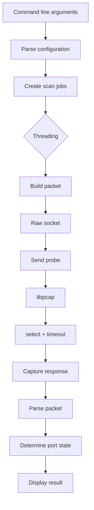

# ft_nmap 👁️


<p align="center">
  
</p>

<p align="center">
  
  
  
</p>

<h3 align="center">A Nmap-inspired port scanner written in C</h3>

---

## 📖 About

**ft_nmap** is a C implementation of a network port scanner inspired by [Nmap](https://nmap.org/).

The goal of the project is to understand how port scanners work at a low level instead of relying on high-level networking APIs.

The scanner builds network packets manually, sends them through **raw sockets**, captures responses using **libpcap**, and analyzes those responses to determine the state of a target port.

The project implements six different scanning techniques:

* **SYN**
* **ACK**
* **NULL**
* **FIN**
* **XMAS**
* **UDP**

It also supports scanning multiple ports and distributing scan jobs across multiple threads.

---

## ✨ Features

* 🔎 TCP SYN scanning
* 🔎 TCP ACK scanning
* 🔎 TCP NULL scanning
* 🔎 TCP FIN scanning
* 🎄 TCP XMAS scanning
* 📡 UDP scanning
* 🎯 IPv4 target scanning
* 🔢 Individual ports and port ranges
* 🧵 Optional multithreading
* 📦 Raw packet construction
* 🐾 Packet capture with libpcap
* ⏱️ Timeout handling with `select()`
* 🧮 Manual IP/TCP/UDP checksum calculation
* 🛡️ Detection of `open`, `closed`, `filtered` and `unfiltered` states

---

## 🧠 How it works

The scanner works at a low network level.



### Packet flow

```text
                 ft_nmap
                    |
                    | Raw Socket
                    v
            +----------------+
            | Crafted Packet |
            +----------------+
                    |
                    v
              Network / Host
                    |
          +---------+---------+
          |                   |
       Response            Timeout
          |                   |
          v                   v
      libpcap              select()
          |
          v
    Packet analysis
          |
          v
     Port state
```

---

# 🔬 Scan types

## SYN Scan

The SYN scan sends a TCP packet containing only the `SYN` flag.

```text
ft_nmap                    Target
   |                          |
   | -------- SYN ----------> |
   |                          |
   | <------ SYN/ACK -------- |
   |                          |
   |         OPEN             |
```

| Response    | Result      |
| ----------- | ----------- |
| `SYN/ACK`   | 🟢 Open     |
| `RST`       | 🔴 Closed   |
| No response | 🟠 Filtered |

Example:

```bash
sudo ./ft_nmap --ip 8.8.8.8 --ports 80 --scan SYN
```

---

## ACK Scan

The ACK scan sends a TCP packet with the `ACK` flag.

It is mainly used to determine whether a port is **filtered**, rather than whether an application is listening.

| Response             | Result        |
| -------------------- | ------------- |
| `RST`                | 🟢 Unfiltered |
| ICMP filtering error | 🔴 Filtered   |
| No response          | 🔴 Filtered   |

Example:

```bash
sudo ./ft_nmap --ip 8.8.8.8 --ports 80 --scan ACK
```

---

## NULL Scan

A NULL scan sends a TCP packet without any TCP flags.

```text
TCP flags:

FIN  = 0
SYN  = 0
RST  = 0
PSH  = 0
ACK  = 0
URG  = 0
```

| Response    | Result           |
| ----------- | ---------------- |
| `RST`       | 🔴 Closed        |
| No response | 🟠 Open|Filtered |

Example:

```bash
sudo ./ft_nmap --ip 8.8.8.8 --ports 80 --scan NULL
```

---

## FIN Scan

A FIN scan sends a TCP packet containing the `FIN` flag.

```text
TCP
+----------------+
| FIN = 1        |
+----------------+
```

| Response    | Result           |
| ----------- | ---------------- |
| `RST`       | 🔴 Closed        |
| No response | 🟠 Open|Filtered |

Example:

```bash
sudo ./ft_nmap --ip 8.8.8.8 --ports 80 --scan FIN
```

---

## XMAS Scan 🎄

The XMAS scan sets three TCP flags:

```text
FIN = 1
PSH = 1
URG = 1
```

This produces the characteristic "XMAS" packet.

```text
        XMAS Packet

       +---------+
       |   FIN   |
       |   PSH   |
       |   URG   |
       +---------+
```

| Response    | Result           |
| ----------- | ---------------- |
| `RST`       | 🔴 Closed        |
| No response | 🟠 Open|Filtered |

Example:

```bash
sudo ./ft_nmap --ip 8.8.8.8 --ports 80 --scan XMAS
```

---

## UDP Scan

UDP scanning works differently because UDP does not establish a connection.

```text
ft_nmap                    Target
   |                          |
   | -------- UDP ----------> |
   |                          |
   | <---- UDP response ----- |  → Open
   |                          |
   | <---- ICMP type 3 ------ |  → Closed / Filtered
   |                          |
   |       timeout            |  → Open|Filtered
```

| Response             | Result           |
| -------------------- | ---------------- |
| UDP response         | 🟢 Open          |
| ICMP type 3 / code 3 | 🔴 Closed        |
| ICMP filtering error | 🟠 Filtered      |
| No response          | 🟡 Open|Filtered |

Example:

```bash
sudo ./ft_nmap --ip 8.8.8.8 --ports 80 --scan UDP
```

---

# 📊 Scan comparison

| Scan | Protocol | Packet      | Open | Closed | Filtered | Unfiltered |
| ---- | -------- | ----------- | ---- | ------ | -------- | ---------- |
| SYN  | TCP      | SYN         | ✅    | ✅      | ✅        | ❌          |
| ACK  | TCP      | ACK         | ❌    | ❌      | ✅        | ✅          |
| NULL | TCP      | No flags    | ❌    | ✅      | ❌*       | ❌          |
| FIN  | TCP      | FIN         | ❌    | ✅      | ❌*       | ❌          |
| XMAS | TCP      | FIN+PSH+URG | ❌    | ✅      | ❌*       | ❌          |
| UDP  | UDP      | UDP         | ✅    | ✅      | ✅        | ❌          |

`*` Depending on the response, the result can also be `Open|Filtered`.

---

# 🛠️ Technologies

## Raw sockets

Raw sockets are used to manually construct and send IP packets.

This allows the program to control:

* IP headers
* TCP headers
* UDP headers
* TCP flags
* source/destination ports
* checksums

Example packet construction:

```text
+----------------------+
|      IPv4 Header     |
+----------------------+
|      TCP / UDP       |
|       Header         |
+----------------------+
|       Payload        |
+----------------------+
```

---

## libpcap

`libpcap` is used to capture packets directly from the network interface.

The program installs BPF filters to avoid processing unrelated traffic.

Example:

```text
Network Interface
       |
       v
    libpcap
       |
       v
  BPF filtering
       |
       v
Relevant packet
       |
       v
Packet parser
```

---

## select()

`select()` allows the scanner to wait for a response while enforcing a timeout.

```text
             select()
                |
       +--------+--------+
       |                 |
   Packet received     Timeout
       |                 |
       v                 v
 Analyze packet       No response
```

This is particularly important for scans where **no response is itself meaningful**, such as:

* NULL
* FIN
* XMAS
* UDP
* SYN filtered ports

---

# 🧮 Checksums

Packets created by ft_nmap require valid checksums.

The project calculates checksums manually using the Internet checksum algorithm.

For TCP and UDP, the checksum also includes a **pseudo-header**:

```text
+----------------------+
| Source IP            |
+----------------------+
| Destination IP       |
+----------------------+
| Reserved             |
+----------------------+
| Protocol             |
+----------------------+
| TCP/UDP length       |
+----------------------+
| TCP/UDP header       |
+----------------------+
| Payload              |
+----------------------+
```

---

# 🧵 Multithreading

Scan jobs can be distributed between multiple POSIX threads.

```text
                 Scan jobs
                    |
          +---------+---------+
          |         |         |
        Thread 1  Thread 2  Thread 3
          |         |         |
        Port 22   Port 80   Port 443
          |         |         |
          +---------+---------+
                    |
                 Results
```

The number of threads can be configured with:

```bash
--speedup <number>
```

Example:

```bash
sudo ./ft_nmap \
    --ip 192.168.1.1 \
    --ports 1-100 \
    --scan SYN \
    --speedup 10
```

---

# 🚀 Installation

## Requirements

* Linux
* GCC / Clang
* Make
* libpcap
* pthreads
* root privileges for raw sockets

On Debian/Ubuntu:

```bash
sudo apt update
sudo apt install build-essential libpcap-dev
```

---

## Build

Clone the repository:

```bash
git clone https://github.com/tren-chvl/ft_nmap.git
cd ft_nmap
```

Compile:

```bash
make
```

Clean object files:

```bash
make clean
```

Remove everything generated by the build:

```bash
make fclean
```

Rebuild:

```bash
make re
```

---

# 💻 Usage

Basic syntax:

```bash
sudo ./ft_nmap --ip <IP> --ports <PORTS> --scan <SCAN>
```

### Scan one port

```bash
sudo ./ft_nmap --ip 8.8.8.8 --ports 80 --scan SYN
```

### Scan multiple ports

```bash
sudo ./ft_nmap --ip 8.8.8.8 --ports 22,80,443 --scan SYN
```

### Scan a range

```bash
sudo ./ft_nmap --ip 8.8.8.8 --ports 1-100 --scan SYN
```

### Run multiple scan types

```bash
sudo ./ft_nmap --ip 8.8.8.8 --ports 22,80,443 --scan SYN/ACK/UDP
```

### Use multiple threads

```bash
sudo ./ft_nmap \
    --ip 192.168.1.1 \
    --ports 1-1024 \
    --scan SYN \
    --speedup 10
```


---

# 🔍 Packet analysis

During development, `tcpdump` can be used to verify that packets are actually being transmitted.

Example:

```bash
sudo tcpdump -ni enp0s3 'tcp and host 8.8.8.8 and port 80'
```

Example SYN packet:

```text
10.11.200.134.44444 > 8.8.8.8.80:
Flags [S], seq 123456, win 65535
```

Example FIN packet:

```text
10.11.200.134.44444 > 8.8.8.8.80:
Flags [F], seq 0, win 65535
```

Example XMAS packet:

```text
10.11.200.134.44444 > 8.8.8.8.80:
Flags [FPU], seq 0, win 65535
```

This is useful for verifying that ft_nmap is actually generating the expected packets.

---

# 📁 Project structure

```text
ft_nmap/
├── Makefile
├── ft_nmap.h
│
└── src/
    ├── main.c
    ├── parse.c
    ├── scan.c
    ├── thread.c
    │
    └── scan/
        ├── generique.c
        ├── scan_syn.c
        ├── scan_ack.c
        ├── scan_null.c
        ├── scan_fin.c
        ├── scan_xmas.c
        └── scan_udp.c
```

---

# 🧪 Testing

For development and debugging, compare the results of ft_nmap with the real Nmap implementation.

For example:

```bash
sudo nmap -Pn -sS -p 80 8.8.8.8
```

Then:

```bash
sudo ./ft_nmap --ip 8.8.8.8 --ports 80 --scan SYN
```

Other scan types:

```bash
sudo nmap -Pn -sA -p 80 8.8.8.8
sudo nmap -Pn -sN -p 80 8.8.8.8
sudo nmap -Pn -sF -p 80 8.8.8.8
sudo nmap -Pn -sX -p 80 8.8.8.8
sudo nmap -Pn -sU -p 80 8.8.8.8
```


---

# ⚠️ Permissions

Raw sockets require elevated privileges on Linux.

Run the scanner with:

```bash
sudo ./ft_nmap ...
```

Without sufficient privileges, raw socket creation may fail.

---

# 🧑‍💻 Learning objectives

This project focuses on low-level networking concepts:

* IPv4 headers
* TCP headers
* UDP headers
* TCP flags
* ICMP responses
* Network byte order
* Checksums
* Raw sockets
* Packet capture
* BPF filters
* `select()`
* POSIX threads
* Network timeouts
* Port-state classification

---

# 🗺️ Development roadmap

* [x] Argument parsing
* [x] Port parsing
* [x] Raw IPv4 packets
* [x] SYN scan
* [x] ACK scan
* [x] NULL scan
* [x] FIN scan
* [x] XMAS scan
* [x] UDP scan
* [x] libpcap packet capture
* [x] `select()` timeout handling
* [x] TCP response filtering
* [x] Multithreading
* [ ] More robust response correlation
* [ ] Improved output formatting
* [ ] More extensive automated tests
* [ ] Better interface configuration

---

# 📚 References

* [Nmap](https://nmap.org/)
* [libpcap](https://www.tcpdump.org/)
* [TCP/IP specifications](https://www.rfc-editor.org/)
* Linux raw sockets documentation
* POSIX threads documentation

---

## 👤 Author


<p align="center">
  <i>tren-chvl</i>
</p>
